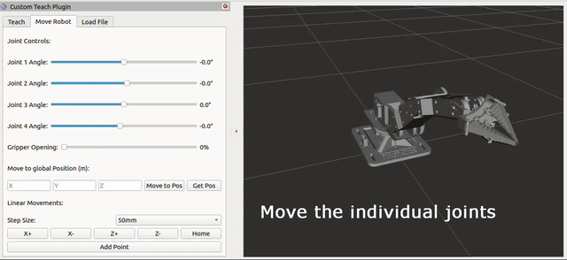

# Robot MoveIt UI Project

This project provides an environment for simulating and controlling a robotic arm using ROS2 Humble and MoveIt2.

---

## UI Demo



To connect to the robot, consult the following repo: https://github.com/mama1120/rpi_ros_can_module

---

## Development Environment

- **Operating System**: Ubuntu 22.04.5 LTS
- **Frameworks**: ROS2 Humble, MoveIt2 Humble
- **Tools**: Git

**GPU Note**: NVIDIA GPUs may have suboptimal graphical performance due to X11 forwarding limitations. Additional packages may be required.

---

## Requirements

Before you begin, ensure you have the following installed:
- [Git](https://git-scm.com/)
- ROS2 Humble
- MoveIt2 Humble
- Colcon build tool
- nlohmann-json3-dev

## Setup Instructions

### 1. Create Workspace and Clone Repository

To get started, first create a workspace directory and then clone the repository:

1. **Create a workspace directory**:
   ```bash
   mkdir -p ~/robot_ws/src
   cd ~/robot_ws/src
   ```

2. **Clone the repository** to your workspace:
   ```bash
   git clone https://github.com/mama1120/robot_arm_UI.git
   ```

3. **Navigate back to the workspace root**:
   ```bash
   cd ~/robot_ws
   ```

---

### 2. Building the Workspace

Build the workspace using colcon (this step is required only once):
```bash
colcon build
```

### 3. Running the Graphical UI

Once the workspace has been built:

1. **Source the workspace**:
   ```bash
   source install/setup.bash
   ```

2. **Start the robot driver and visualization**:
   ```bash
   ros2 launch robot_moveit_config robot_UI.launch.py
   ```
   This should open up RViz, and you should see the robot model. You can interact with MoveIt2, and the robot should move in the visualization.


